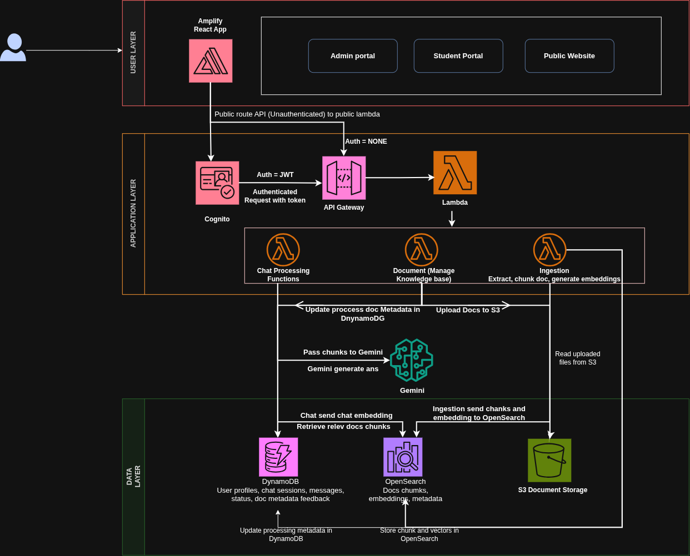

# AI-Powered Student Support System

A serverless, AI-powered student support platform built for academic institutions. It helps students ask questions in natural language, retrieves grounded answers from approved institutional documents, and supports document review and feedback workflows for administrators.

## Why this project matters

Educational teams often spend significant time answering repetitive academic and administrative questions. This system is designed to reduce first-response time for common FAQs by routing them to a document-grounded assistant instead of relying only on staff availability.

## Key features

- AI chat assistant for student support
- Retrieval-augmented generation grounded in institutional documents
- Document upload, review, approval, and deletion workflows
- Conversation history and feedback collection
- Secure authentication and role-based access
- Serverless deployment on AWS with Terraform
- Local mock mode for frontend development

The mock mode is intended for UI and workflow testing without depending on live AWS services. It simulates API responses, authentication flows, and AI answers so frontend work can proceed even when the backend is not yet running.

## Architecture at a glance

- Frontend: React, TypeScript, and Vite
- Backend: Python-based AWS Lambda handlers
- Data storage: DynamoDB
- File storage: Amazon S3
- Search layer: OpenSearch Serverless
- AI generation and embeddings: Amazon Bedrock or compatible providers
- Infrastructure: Terraform


### System Architecture



Interactive Source: [draw.io diagram](https://drive.google.com/file/d/1IOWVk5wiRwW7vo87qKzbIsLCoi3O_mrz/view?usp=sharing)


A visual overview of the system design is available here:

- [Architecture overview](docs/ARCHITECTURE.md)

## Project structure

```text
AI-Powered-Student-Support-System/
├── backend/                    # Lambda handlers, shared utilities, and backend tests
│   ├── src/                    # Feature-based backend modules
│   ├── tests/                  # Python tests
│   └── docs/                   # Backend API documentation
├── frontend/                   # Frontend application
│   └── student-ai-support/     # Vite + React + TypeScript app
├── terraform/                  # Infrastructure as Code for AWS resources
│   └── backend/                # Terraform configuration
├── docs/                       # Project documentation and guides
└── README.md                   # Project overview and entry point
```

## Getting started

### Prerequisites

- Python 3.11 or 3.12
- Node.js 20+
- npm
- Terraform 1.5+
- AWS CLI configured with access to your target account

### 1. Clone the repository

```bash
git clone https://github.com/Humaidu/AI-Powered-Student-Support-System.git
cd AI-Powered-Student-Support-System
```

### 2. Set up the backend

```bash
cd backend
python -m venv .venv
source .venv/bin/activate   # Windows: .venv\Scripts\activate
pip install -r requirements.txt
pip install -r requirements-lambda.txt
```

### 3. Set up the frontend

```bash
cd ../frontend/student-ai-support
npm install
```

### 4. Run locally

Start the frontend application:

```bash
npm run dev
```

The frontend supports mock mode by default. In mock mode, the app uses simulated responses for chat, auth, and document actions. To use the real AWS-backed flow, set:

```bash
export VITE_APP_MODE=aws
export VITE_API_BASE_URL=http://localhost:3000/api/v1
```

Run backend tests:

```bash
cd ../../backend
pytest tests -v
```

## API endpoints

The application exposes REST-style endpoints under the shared API base path `/api/v1`. All routes are expected to be called with an authenticated user context, typically through a bearer token issued by the configured identity provider; see [backend/docs/API_CONTRACT.md](backend/docs/API_CONTRACT.md) for the full contract.

Common routes include:

- `POST /api/v1/documents` — create document metadata and obtain an upload URL
- `GET /api/v1/documents` — list documents
- `GET /api/v1/documents/{documentId}` — retrieve document details
- `DELETE /api/v1/documents/{documentId}` — delete a document
- `POST /api/v1/documents/{documentId}/approve` — approve a document for student access
- `POST /api/v1/chat/sessions` and related chat routes — create and manage chat sessions and messages
- `POST /api/v1/feedback` — submit feedback for AI responses

For the full request/response contract, see [backend/docs/API_CONTRACT.md](backend/docs/API_CONTRACT.md).

## Deployment

Infrastructure is managed with Terraform from the backend module:

```bash
cd terraform/backend
terraform init
terraform plan
terraform apply
```

## Troubleshooting and FAQ

Common issues you may hit when working with this stack include:

- OpenSearch Serverless access or indexing problems after deployment
- Bedrock or model access issues when generating embeddings or answers
- Lambda permission errors caused by incomplete IAM configuration
- Frontend requests failing because the app is still in mock mode or the API base URL is incorrect
- Cold starts or slow responses during early-stage development and deployment testing

For deeper guidance, see the deployment and operations documentation in [docs/DEPLOYMENT_AND_OPERATIONS_GUIDE.md](docs/DEPLOYMENT_AND_OPERATIONS_GUIDE.md).

## Documentation

Useful references for contributors and operators:

- [Developer Onboarding Guide](docs/DEVELOPER_ONBOARDING_GUIDE.md)
- [Deployment and Operations Guide](docs/DEPLOYMENT_AND_OPERATIONS_GUIDE.md)
- [Architecture Overview](docs/ARCHITECTURE.md)
- [Architecture Diagram](docs/ARCHITECTURE_DIAGRAM.png)
- [Backend Development Guide](docs/BACKEND_DEVELOPMENT_GUIDE.md)
- [API Contract](backend/docs/API_CONTRACT.md)

## Team

| Name | Role |
|------|------|
| Richard Vidzrakou | Team Leader |
| William Mukoyani | Mentor |
| Freda Kemphrey | Member |
| Hassanatu Ahmed | Member |
| Humaidu Ali Mohammed | Member |
| Joel Addition | Member |
| Frank Amoako Boafo | Member |

## Future improvements

Planned next steps for the project include:

- adding stronger production monitoring and alerting
- improving document ingestion and search quality
- expanding admin workflows and governance controls
- refining the AI response experience with better grounding and feedback loops

## License

Internal Azubi Africa project — for educational use.